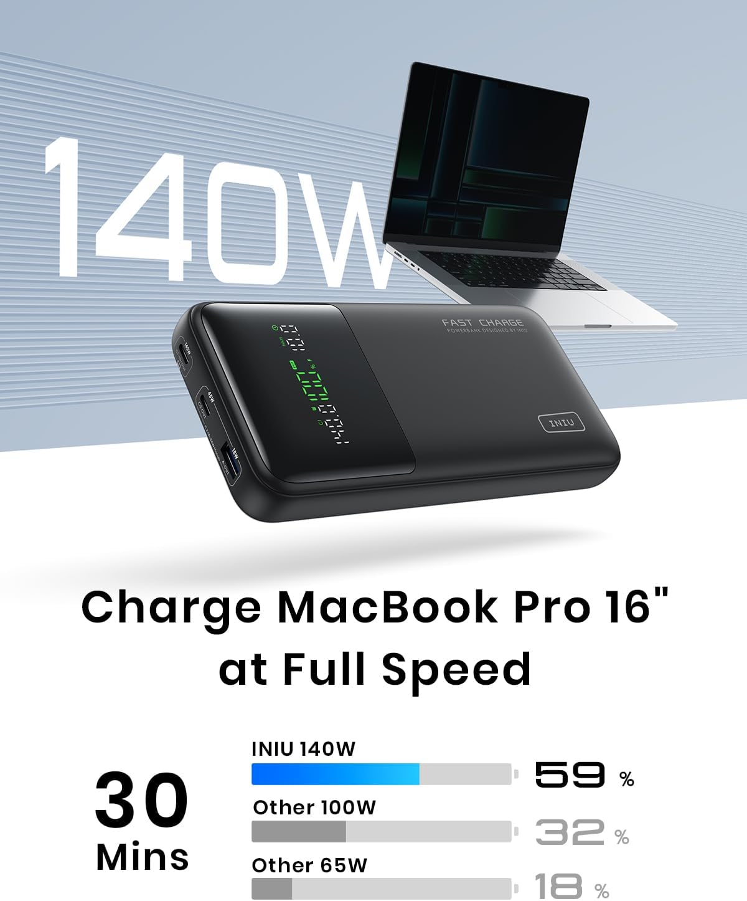
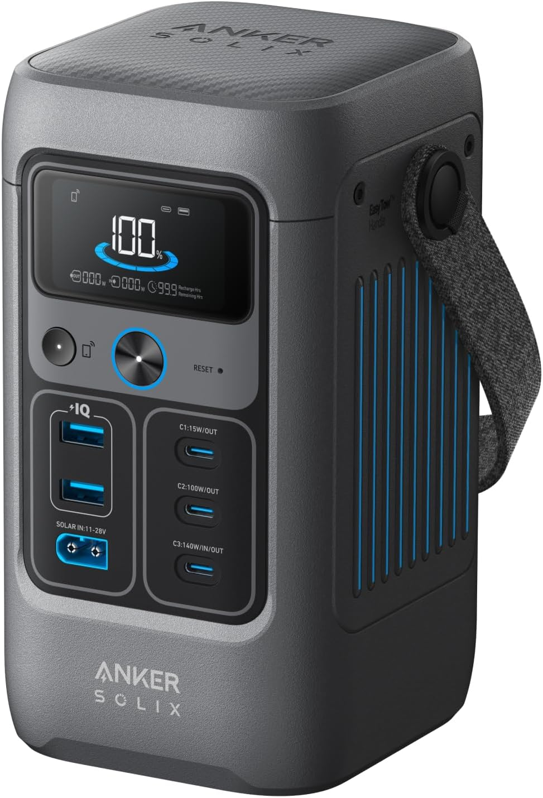
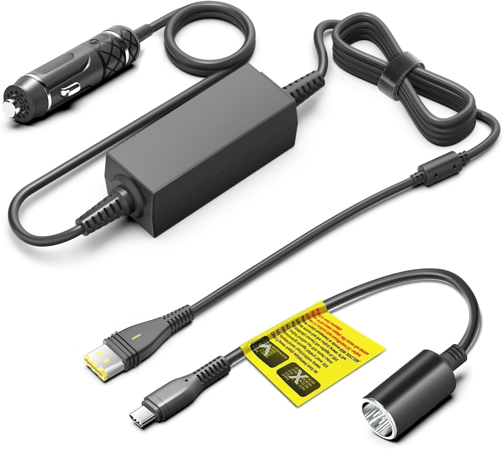
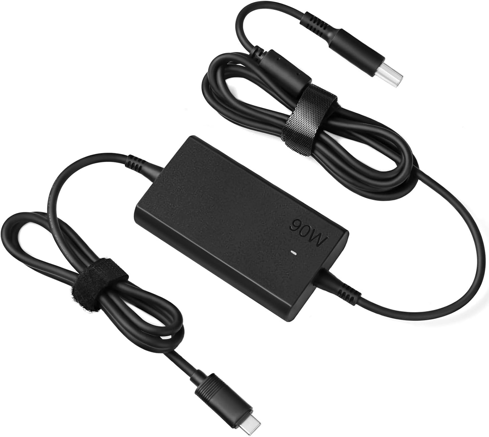

# Best Batteries That Work with CPAP

This article collects **practical, real-world batteries that actually work
with CPAP machines**, especially **ResMed AirSense 10 and 11**.
Focused on van life, camping, travel, and power outages.

If you know a battery that works well and isn’t listed, suggest it in the
comments — I’ll keep this updated.

---

## Batteries Compatible with CPAP Machines

### 🔋 INIU Power Bank

- Type: High-capacity power bank  
- Output: USB-C PD (up to 65W)  
- Works with CPAP using a **USB-C PD → DC converter**  
- Compact and lightweight  
- Best for: minimal setups, single-night use  

👉 [Check price on Amazon](https://amzn.to/3LdG2lX)

---

### 🔋 Baseus Power Bank

- Type: Power bank  
- Output: USB-C PD (60W–100W depending on model)  
- Requires a **USB-C PD → DC adapter**  
- Good balance between size and power  
- Best for: optimized overnight CPAP use  

👉 [Check price on Amazon](https://amzn.to/4jpnNXC)

---

### 🔋 Anker Power Station (C200)

- Type: Portable power station  
- Output: AC + DC + USB  
- Can power CPAP directly via **AC outlet** or DC  
- Much larger capacity than power banks  
- Best for: multi-night use, off-grid reliability  

👉 [Check price on Amazon](https://amzn.to/49biUN7)

---

## Required Adapters for ResMed AirSense 10 & 11

### AirSense 11 Adapter

- Required to run AirSense 11 from batteries or power banks  
- Uses USB-C PD / 24V conversion  
- Much more efficient than AC inverters  

👉 [Check price on Amazon](https://amzn.to/4phZKLf)

---

### AirSense 10 Adapter

- Converts battery output to proper DC voltage  
- Avoids power loss from AC inversion  
- Extends battery runtime significantly  

👉 [Check price on Amazon](https://amzn.to/3YeCDGE)

---

## Important Power-Saving Notes (Critical)

- **Turn OFF humidifier**
- **Turn OFF heated hose**
- These two features can **double or triple power consumption**

With both OFF:
- Power banks → usually **1 full night**
- Power stations → **multiple nights**

---

## Summary

- Power banks (INIU / Baseus): portable, limited runtime  
- Power stations (Anker): heavier, long runtime  
- Always use **DC or USB-C adapters**, not AC inverters  
- Disabling humidity and heated hose is essential for battery use  

---

**Disclosure:** Some links may be affiliate links. They don’t change the price you pay.
