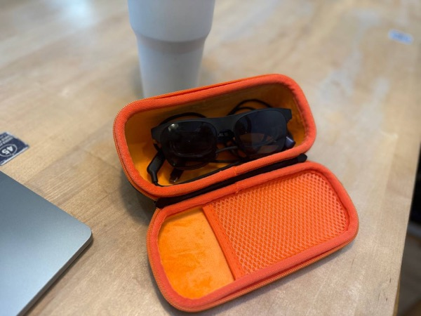
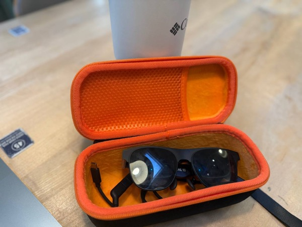

If you’re looking for a case for **XREAL 1S**, **XREAL One series**, or basically **any AR glasses**, mainly for **storing them without removing the cable**, this one works much better than the original tight case.

The glasses fit inside naturally with no pressure. You don’t need to unplug the cable, and it doesn’t get pinched or crushed. Compared to the stock case, this is simply more usable for daily storage.

👉 [Check price on Amazon](https://amzn.to/4bEPOIT)

The material feels solid and good in hand. It’s not flimsy and actually protects the glasses instead of squeezing them.

👉 [Check price on Amazon](https://amzn.to/4bEPOIT)

There’s also an extra pocket inside, which is perfect for storing the charging dongle or small accessories, so everything stays in one place.

👉 [Check price on Amazon](https://amzn.to/4bEPOIT)

