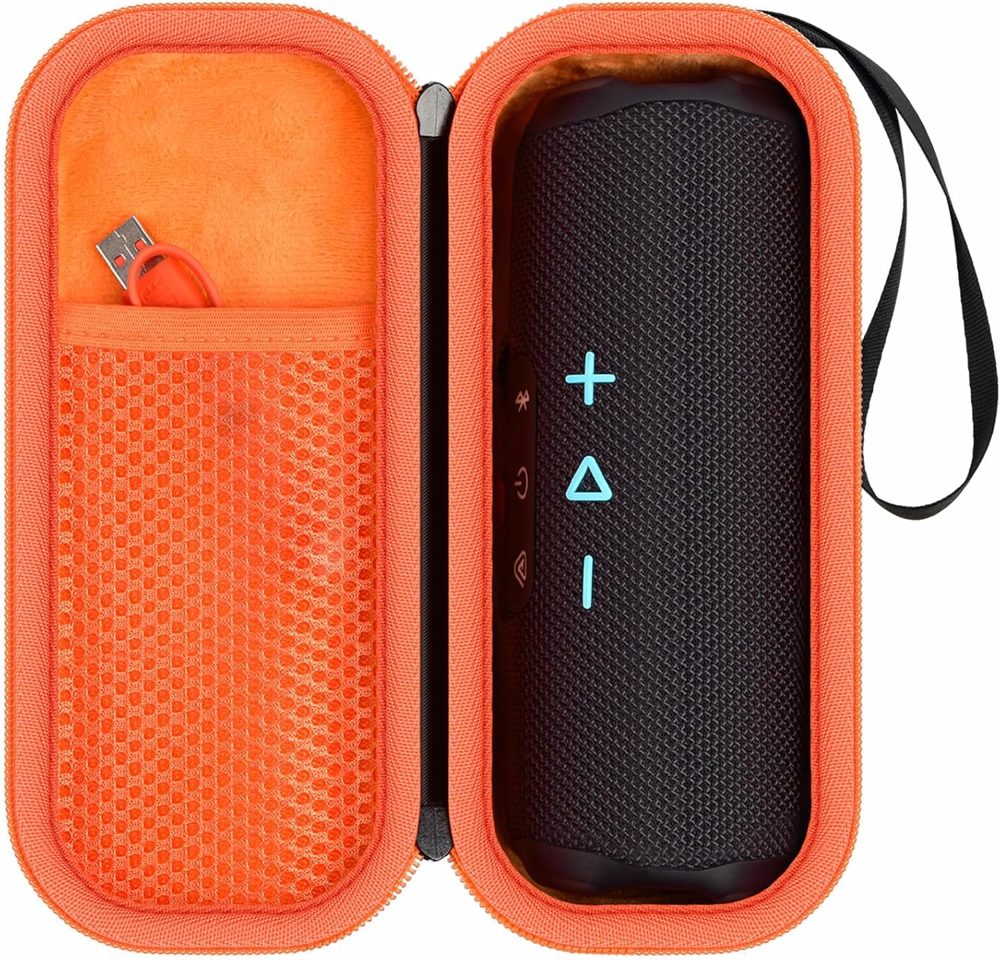
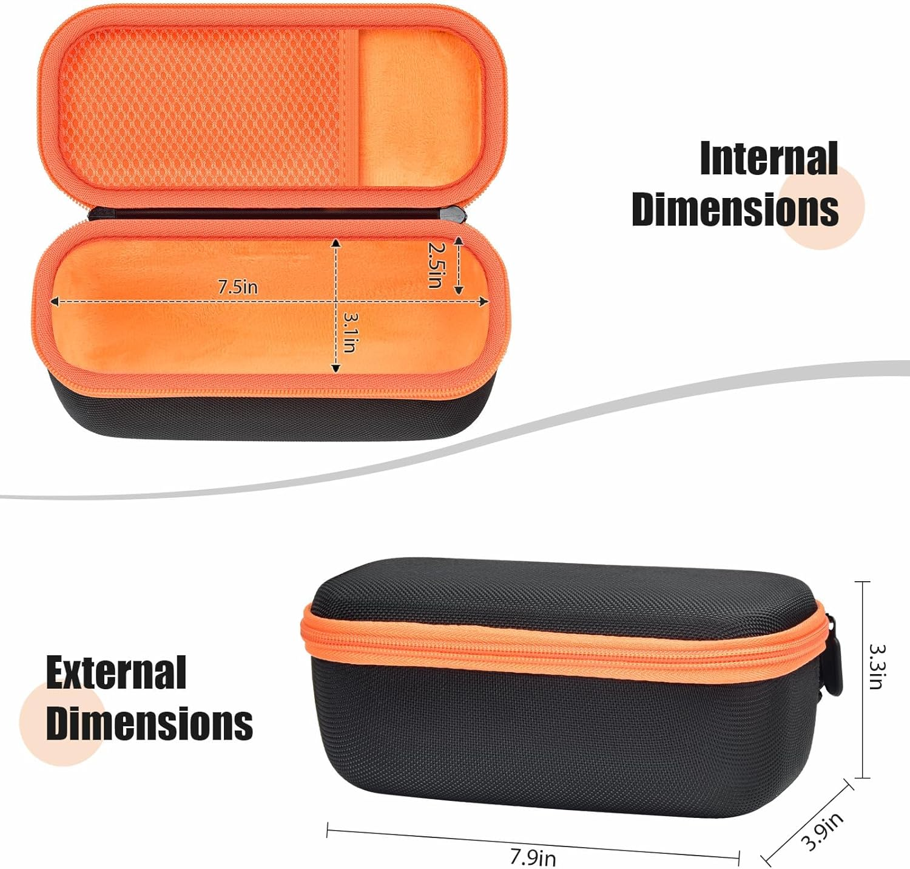

I found this case while looking for a simple protective option, and it fits my XREAL 1S very well.

The glasses sit inside properly with no pressure and no looseness. It does its job as a protective case without forcing anything.

👉 [Check price on Amazon](https://amzn.to/4bEPOIT)

Even though this case is designed for a speaker, it works very well for these glasses. There’s no need to unplug the cable, and it doesn’t pinch or crush it.

👉 [Check price on Amazon](https://amzn.to/4bEPOIT)

Everything fits naturally, and the cable sits inside without stress or awkward bending.

👉 [Check price on Amazon](https://amzn.to/4bEPOIT)
